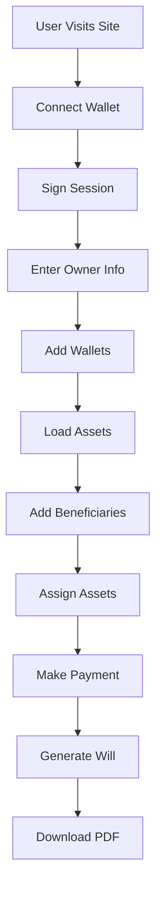

# Developer Guide

## Table of Contents
1. [Development Environment Setup](#development-environment-setup)
2. [Architecture Overview](#architecture-overview)
3. [Code Structure](#code-structure)
4. [API Integration](#api-integration)
5. [State Management](#state-management)
6. [Testing](#testing)
7. [Deployment](#deployment)
8. [Contributing](#contributing)
9. [Advanced Features](#advanced-features)
10. [Performance Optimization](#performance-optimization)

## Development Environment Setup

### Prerequisites

**Required Software:**
- Node.js 14+ (for package management and tooling)
- Git (for version control)
- Modern web browser with developer tools
- Code editor (VS Code recommended)

**Recommended Extensions (VS Code):**
- ES6 String HTML
- Live Server
- Prettier
- ESLint
- GitLens

### Local Development Setup

1. **Clone the Repository**
   ```bash
   git clone https://github.com/your-username/lastwish-eth.git
   cd lastwish-eth
   ```

2. **Install Dependencies**
   ```bash
   npm install
   ```

3. **Environment Configuration**
   ```bash
   cp .env.example .env
   ```
   
   Edit `.env` with your development API keys:
   ```env
   MORALIS_API_KEY=your_development_api_key
   WALLETCONNECT_PROJECT_ID=your_development_project_id
   ```

4. **Start Development Server**
   ```bash
   npm start
   ```
   
   This starts a local HTTP server on `http://localhost:8000`

5. **Development Configuration**
   
   For development, update `src/config.js`:
   ```javascript
   window.LASTWISH_CONFIG = {
     chainId: 5, // Goerli testnet for development
     payToAddress: "0xYourTestAddress",
     payAmountEth: 0.0001,
     ensDiscountPercent: 20,
     n8nWebhookUrl: "",
     moralisApiKey: "YOUR_DEV_API_KEY",
     walletConnectProjectId: "YOUR_DEV_PROJECT_ID"
   };
   ```

### Development Tools

**Browser Developer Tools:**
- Use Chrome DevTools for debugging
- Monitor network requests in Network tab
- Check console for JavaScript errors
- Use Application tab for localStorage inspection

**Debugging Web3 Interactions:**
- Install MetaMask in development browser
- Use Goerli testnet for testing
- Get test ETH from faucets
- Monitor transactions on Goerli Etherscan

## Architecture Overview

### Technology Stack

**Frontend:**
- Vanilla HTML5, CSS3, JavaScript (ES6+)
- No framework dependencies for simplicity
- Modern browser APIs for Web3 integration
- Responsive design with CSS Grid and Flexbox

**Blockchain Integration:**
- Ethereum JSON-RPC API
- WalletConnect for wallet connectivity
- Moralis API for blockchain data
- ENS resolution for user-friendly addresses

**Data Storage:**
- Browser localStorage for user data
- No backend database required
- Client-side state management
- Secure session handling

### Application Flow



### Component Architecture

**Core Components:**
- **WalletManager**: Handles wallet connections and transactions
- **AssetLoader**: Fetches and manages digital assets
- **BeneficiaryManager**: Manages beneficiary data
- **PaymentProcessor**: Handles platform fee payments
- **WillGenerator**: Creates the final will document
- **StorageManager**: Manages local data persistence

## Code Structure

### File Organization

```
src/
├── app.js              # Main application logic
├── config.js           # Configuration settings
└── styles.css          # Application styling

docs/
├── api.md              # API documentation
├── user-guide.md       # User documentation
└── developer-guide.md  # This file

.github/
└── workflows/
    └── deploy.yml      # CI/CD configuration
```

### JavaScript Architecture

**Main Application Structure:**
```javascript
(function() {
  // Configuration and constants
  const cfg = window.LASTWISH_CONFIG || {};
  
  // DOM element references
  const elements = {
    // Wallet elements
    btnConnect: $("#btnConnect"),
    btnSign: $("#btnSign"),
    // ... other elements
  };
  
  // Application state
  let state = {
    currentAccount: null,
    currentChainId: null,
    currentEns: null,
    sessionSig: null,
    beneficiaries: [],
    assignments: {},
    additionalWallets: []
  };
  
  // Core functions
  function init() { /* initialization */ }
  function connectWallet() { /* wallet connection */ }
  function loadAssets() { /* asset loading */ }
  // ... other functions
  
  // Event listeners
  elements.btnConnect.addEventListener('click', connectWallet);
  // ... other listeners
  
  // Initialize application
  init();
})();
```

### CSS Architecture

**CSS Custom Properties (Variables):**
```css
:root {
  --bg: #000000;
  --card-bg: #16181c;
  --border: #2f3336;
  --text: #e7e9ea;
  --text-muted: #71767b;
  --blue: #1d9bf0;
  --green: #00ba7c;
  --red: #f4212e;
  --purple: #7856ff;
  --hover: #1e2328;
}
```

**Component-Based Styling:**
- `.card` - Main content containers
- `.btn` - Button base styles with variants
- `.grid-2`, `.grid-3` - Layout utilities
- `.hidden` - Visibility utilities
- Responsive breakpoints for mobile support

### State Management

**Local Storage Schema:**
```javascript
// Storage keys are prefixed with account address
const storageKeys = {
  beneficiaries: `lastwish_beneficiaries_v3_${account}`,
  assignments: `lastwish_assignments_v3_${account}`,
  wallets: `lastwish_wallets_v3_${account}`,
  ownerName: `lastwish_owner_name_v3_${account}`,
  instructions: `lastwish_special_instructions_v3_${account}`
};
```

**State Persistence:**
```javascript
function saveState() {
  localStorage.setItem(storageKeys.beneficiaries, JSON.stringify(beneficiaries));
  localStorage.setItem(storageKeys.assignments, JSON.stringify(assignments));
  localStorage.setItem(storageKeys.wallets, JSON.stringify(additionalWallets));
  // ... save other state
}

function loadState() {
  beneficiaries = JSON.parse(localStorage.getItem(storageKeys.beneficiaries) || '[]');
  assignments = JSON.parse(localStorage.getItem(storageKeys.assignments) || '{}');
  additionalWallets = JSON.parse(localStorage.getItem(storageKeys.wallets) || '[]');
  // ... load other state
}
```

## API Integration

### Moralis API Integration

**Asset Loading Implementation:**
```javascript
async function loadERC20Tokens(address) {
  try {
    const response = await fetch(
      `https://deep-index.moralis.io/api/v2.2/${address}/erc20?chain=eth`,
      {
        headers: {
          'X-API-Key': cfg.moralisApiKey
        }
      }
    );
    
    if (!response.ok) {
      throw new Error(`HTTP ${response.status}: ${response.statusText}`);
    }
    
    const tokens = await response.json();
    return tokens.filter(token => parseFloat(token.balance) > 0);
  } catch (error) {
    console.error('Failed to load ERC20 tokens:', error);
    throw error;
  }
}
```

**ENS Resolution:**
```javascript
async function resolveENS(ensName) {
  try {
    const response = await fetch(
      `https://deep-index.moralis.io/api/v2.2/resolve/ens/${ensName}`,
      {
        headers: {
          'X-API-Key': cfg.moralisApiKey
        }
      }
    );
    
    if (response.ok) {
      const data = await response.json();
      return data.address;
    }
    return null;
  } catch (error) {
    console.warn('ENS resolution failed:', error);
    return null;
  }
}
```

### Web3 Integration

**Wallet Connection:**
```javascript
async function connectWallet() {
  if (!window.ethereum) {
    alert('Please install MetaMask or another Web3 wallet');
    return;
  }
  
  try {
    // Request account access
    await window.ethereum.request({ method: 'eth_requestAccounts' });
    
    // Get accounts and chain ID
    const accounts = await window.ethereum.request({ method: 'eth_accounts' });
    const chainIdHex = await window.ethereum.request({ method: 'eth_chainId' });
    const chainId = parseInt(chainIdHex, 16);
    
    // Validate network
    if (cfg.chainId && chainId !== cfg.chainId) {
      await switchNetwork(cfg.chainId);
    }
    
    // Update state
    currentAccount = accounts[0];
    currentChainId = chainId;
    
    // Set up event listeners
    setupWalletEventListeners();
    
    // Update UI
    updateWalletUI();
    
  } catch (error) {
    console.error('Wallet connection failed:', error);
    handleWalletError(error);
  }
}
```

**Transaction Handling:**
```javascript
async function sendPayment() {
  const amount = priceWithDiscount();
  const amountWei = (amount * 1e18).toString(16);
  
  try {
    const txHash = await window.ethereum.request({
      method: 'eth_sendTransaction',
      params: [{
        from: currentAccount,
        to: cfg.payToAddress,
        value: `0x${amountWei}`
      }]
    });
    
    // Wait for confirmation
    await waitForTransaction(txHash);
    
    // Update UI
    showPaymentSuccess(txHash);
    
  } catch (error) {
    console.error('Payment failed:', error);
    handlePaymentError(error);
  }
}
```

## State Management

### Data Models

**Beneficiary Model:**
```javascript
const beneficiary = {
  id: Date.now(), // Unique identifier
  name: "John Doe", // Full legal name
  address: "0x...", // Ethereum address
  ens: "john.eth", // ENS name (optional)
  email: "john@example.com", // Contact email
  relationship: "Son" // Relationship to owner
};
```

**Asset Assignment Model:**
```javascript
const assignment = {
  tokenAddress: "0x...", // Token contract address
  tokenId: "1", // For NFTs (null for ERC20)
  beneficiaryId: 12345, // Reference to beneficiary
  percentage: 50 // Percentage allocation (1-100)
};
```

**Wallet Model:**
```javascript
const wallet = {
  id: Date.now(), // Unique identifier
  address: "0x...", // Ethereum address
  ens: "alice.eth", // ENS name (if applicable)
  addedAt: new Date().toISOString() // Timestamp
};
```

### State Validation

**Input Validation:**
```javascript
function validateEthereumAddress(address) {
  return /^0x[a-fA-F0-9]{40}$/.test(address);
}

function validateENSName(name) {
  return /^[a-zA-Z0-9-]+\.eth$/.test(name);
}

function validateEmail(email) {
  return /^[^\s@]+@[^\s@]+\.[^\s@]+$/.test(email);
}

function validatePercentage(percentage) {
  const num = parseFloat(percentage);
  return !isNaN(num) && num >= 0 && num <= 100;
}
```

**State Consistency Checks:**
```javascript
function validateAssignments() {
  const errors = [];
  
  // Check that all assignments reference valid beneficiaries
  Object.keys(assignments).forEach(assetKey => {
    assignments[assetKey].forEach(assignment => {
      const beneficiary = beneficiaries.find(b => b.id === assignment.beneficiaryId);
      if (!beneficiary) {
        errors.push(`Assignment references invalid beneficiary: ${assignment.beneficiaryId}`);
      }
    });
  });
  
  // Check that percentages don't exceed 100%
  Object.keys(assignments).forEach(assetKey => {
    const totalPercentage = assignments[assetKey].reduce(
      (sum, assignment) => sum + assignment.percentage, 0
    );
    if (totalPercentage > 100) {
      errors.push(`Asset ${assetKey} has over-allocated percentages: ${totalPercentage}%`);
    }
  });
  
  return errors;
}
```

## Testing

### Manual Testing Checklist

**Wallet Connection:**
- [ ] Connect with MetaMask
- [ ] Connect with Coinbase Wallet
- [ ] Test network switching
- [ ] Test account switching
- [ ] Test disconnection

**Asset Loading:**
- [ ] Load real assets from connected wallet
- [ ] Load demo data
- [ ] Handle empty wallets
- [ ] Test with various token types
- [ ] Test NFT metadata loading

**Beneficiary Management:**
- [ ] Add beneficiaries with all fields
- [ ] Add beneficiaries with minimal info
- [ ] Edit existing beneficiaries
- [ ] Remove beneficiaries
- [ ] Validate input fields

**Payment Processing:**
- [ ] Test payment with sufficient funds
- [ ] Test payment with insufficient funds
- [ ] Test ENS discount application
- [ ] Test transaction confirmation
- [ ] Test payment failure handling

### Automated Testing Setup

**Test Framework Setup:**
```javascript
// Simple test framework for browser environment
class TestRunner {
  constructor() {
    this.tests = [];
    this.results = [];
  }
  
  test(name, fn) {
    this.tests.push({ name, fn });
  }
  
  async run() {
    console.log('Running tests...');
    
    for (const test of this.tests) {
      try {
        await test.fn();
        this.results.push({ name: test.name, status: 'PASS' });
        console.log(`✅ ${test.name}`);
      } catch (error) {
        this.results.push({ name: test.name, status: 'FAIL', error });
        console.log(`❌ ${test.name}: ${error.message}`);
      }
    }
    
    this.printSummary();
  }
  
  printSummary() {
    const passed = this.results.filter(r => r.status === 'PASS').length;
    const failed = this.results.filter(r => r.status === 'FAIL').length;
    console.log(`\nTest Summary: ${passed} passed, ${failed} failed`);
  }
}
```

**Example Tests:**
```javascript
const runner = new TestRunner();

runner.test('validateEthereumAddress should accept valid addresses', () => {
  const validAddress = '0x1234567890123456789012345678901234567890';
  if (!validateEthereumAddress(validAddress)) {
    throw new Error('Valid address rejected');
  }
});

runner.test('validateEthereumAddress should reject invalid addresses', () => {
  const invalidAddress = '0x123';
  if (validateEthereumAddress(invalidAddress)) {
    throw new Error('Invalid address accepted');
  }
});

runner.test('calculateTotalPercentage should sum correctly', () => {
  const assignments = [
    { percentage: 30 },
    { percentage: 40 },
    { percentage: 30 }
  ];
  const total = assignments.reduce((sum, a) => sum + a.percentage, 0);
  if (total !== 100) {
    throw new Error(`Expected 100, got ${total}`);
  }
});

// Run tests
runner.run();
```

### Integration Testing

**Mock API Responses:**
```javascript
// Mock Moralis API for testing
function mockMoralisAPI() {
  const originalFetch = window.fetch;
  
  window.fetch = async (url, options) => {
    if (url.includes('moralis.io')) {
      // Return mock data based on URL
      if (url.includes('/erc20')) {
        return {
          ok: true,
          json: () => Promise.resolve([
            {
              token_address: '0xa0b86a33e6776e681e9f29e32a1f8b1c8e8b8c8d',
              name: 'Test Token',
              symbol: 'TEST',
              decimals: 18,
              balance: '1000000000000000000'
            }
          ])
        };
      }
      
      if (url.includes('/resolve/ens/')) {
        return {
          ok: true,
          json: () => Promise.resolve({
            address: '0x1234567890123456789012345678901234567890'
          })
        };
      }
    }
    
    return originalFetch(url, options);
  };
}
```

## Deployment

### Production Build

**Build Process:**
```bash
# Install dependencies
npm install

# Run tests
npm test

# Build for production
npm run build

# Deploy to hosting service
npm run deploy
```

**Environment Configuration:**
```javascript
// Production config
window.LASTWISH_CONFIG = {
  chainId: 1, // Ethereum Mainnet
  payToAddress: "0xYourProductionAddress",
  payAmountEth: 0.0001,
  ensDiscountPercent: 20,
  n8nWebhookUrl: "https://your-webhook-url.com",
  moralisApiKey: process.env.MORALIS_API_KEY,
  walletConnectProjectId: process.env.WALLETCONNECT_PROJECT_ID
};
```

### Hosting Options

**GitHub Pages:**
- Free hosting for static sites
- Automatic deployment via GitHub Actions
- Custom domain support
- HTTPS enabled by default

**IPFS Deployment:**
```bash
# Install IPFS CLI
npm install -g ipfs

# Add project to IPFS
ipfs add -r .

# Pin content
ipfs pin add QmYourHashHere

# Access via gateway
# https://ipfs.io/ipfs/QmYourHashHere
```

**Traditional Web Hosting:**
- Upload all files to web server
- Ensure HTTPS is enabled
- Configure proper MIME types
- Set up domain and SSL certificate

### Monitoring and Analytics

**Error Tracking:**
```javascript
window.addEventListener('error', (event) => {
  console.error('Global error:', event.error);
  
  // Send to error tracking service
  if (typeof gtag !== 'undefined') {
    gtag('event', 'exception', {
      description: event.error.message,
      fatal: false
    });
  }
});
```

**Usage Analytics:**
```javascript
// Track user interactions
function trackEvent(action, category = 'User Interaction') {
  if (typeof gtag !== 'undefined') {
    gtag('event', action, {
      event_category: category,
      event_label: window.location.pathname
    });
  }
}

// Usage examples
trackEvent('wallet_connected', 'Wallet');
trackEvent('assets_loaded', 'Assets');
trackEvent('payment_completed', 'Payment');
```

## Contributing

### Development Workflow

1. **Fork the Repository**
   ```bash
   git clone https://github.com/your-username/lastwish-eth.git
   cd lastwish-eth
   git remote add upstream https://github.com/original/lastwish-eth.git
   ```

2. **Create Feature Branch**
   ```bash
   git checkout -b feature/your-feature-name
   ```

3. **Make Changes**
   - Follow existing code style
   - Add tests for new functionality
   - Update documentation as needed
   - Test thoroughly in multiple browsers

4. **Commit Changes**
   ```bash
   git add .
   git commit -m "Add your feature description"
   ```

5. **Push and Create PR**
   ```bash
   git push origin feature/your-feature-name
   ```

### Code Style Guidelines

**JavaScript:**
- Use ES6+ features where appropriate
- Prefer `const` and `let` over `var`
- Use meaningful variable names
- Add comments for complex logic
- Keep functions small and focused

**CSS:**
- Use CSS custom properties for theming
- Follow BEM naming convention for classes
- Group related properties together
- Use relative units (rem, em) for scalability

**HTML:**
- Use semantic HTML elements
- Include proper accessibility attributes
- Validate markup with W3C validator
- Optimize for SEO and social sharing

### Pull Request Guidelines

**PR Description Template:**
```markdown
## Description
Brief description of changes

## Type of Change
- [ ] Bug fix
- [ ] New feature
- [ ] Breaking change
- [ ] Documentation update

## Testing
- [ ] Manual testing completed
- [ ] Automated tests pass
- [ ] Cross-browser testing done

## Screenshots
Include screenshots for UI changes

## Checklist
- [ ] Code follows style guidelines
- [ ] Self-review completed
- [ ] Documentation updated
- [ ] No console errors
```

## Advanced Features

### Multi-Chain Support

**Chain Configuration:**
```javascript
const SUPPORTED_CHAINS = {
  1: {
    name: 'Ethereum Mainnet',
    rpcUrl: 'https://mainnet.infura.io/v3/YOUR_KEY',
    blockExplorer: 'https://etherscan.io'
  },
  137: {
    name: 'Polygon',
    rpcUrl: 'https://polygon-rpc.com',
    blockExplorer: 'https://polygonscan.com'
  },
  56: {
    name: 'BSC',
    rpcUrl: 'https://bsc-dataseed.binance.org',
    blockExplorer: 'https://bscscan.com'
  }
};
```

**Chain Switching:**
```javascript
async function switchChain(chainId) {
  try {
    await window.ethereum.request({
      method: 'wallet_switchEthereumChain',
      params: [{ chainId: `0x${chainId.toString(16)}` }]
    });
  } catch (error) {
    if (error.code === 4902) {
      // Chain not added to wallet
      await addChain(chainId);
    } else {
      throw error;
    }
  }
}
```

### Smart Contract Integration

**Will Contract Interface:**
```javascript
const WILL_CONTRACT_ABI = [
  {
    "inputs": [
      {"name": "_beneficiaries", "type": "address[]"},
      {"name": "_percentages", "type": "uint256[]"}
    ],
    "name": "createWill",
    "outputs": [],
    "stateMutability": "payable",
    "type": "function"
  }
];

async function deployWillContract(beneficiaries, percentages) {
  const contract = new ethers.Contract(
    WILL_CONTRACT_ADDRESS,
    WILL_CONTRACT_ABI,
    signer
  );
  
  const tx = await contract.createWill(beneficiaries, percentages, {
    value: ethers.utils.parseEther("0.0001")
  });
  
  return tx.wait();
}
```

### Offline Support

**Service Worker Registration:**
```javascript
if ('serviceWorker' in navigator) {
  navigator.serviceWorker.register('/sw.js')
    .then(registration => {
      console.log('SW registered:', registration);
    })
    .catch(error => {
      console.log('SW registration failed:', error);
    });
}
```

**Cache Strategy:**
```javascript
// sw.js
const CACHE_NAME = 'lastwish-v1';
const urlsToCache = [
  '/',
  '/src/styles.css',
  '/src/app.js',
  '/src/config.js'
];

self.addEventListener('install', event => {
  event.waitUntil(
    caches.open(CACHE_NAME)
      .then(cache => cache.addAll(urlsToCache))
  );
});

self.addEventListener('fetch', event => {
  event.respondWith(
    caches.match(event.request)
      .then(response => response || fetch(event.request))
  );
});
```

## Performance Optimization

### Code Splitting

**Lazy Loading Modules:**
```javascript
async function loadAssetModule() {
  const { AssetLoader } = await import('./modules/asset-loader.js');
  return new AssetLoader();
}

async function loadPaymentModule() {
  const { PaymentProcessor } = await import('./modules/payment-processor.js');
  return new PaymentProcessor();
}
```

### Caching Strategies

**API Response Caching:**
```javascript
class APICache {
  constructor(ttl = 300000) { // 5 minutes default
    this.cache = new Map();
    this.ttl = ttl;
  }
  
  set(key, value) {
    this.cache.set(key, {
      value,
      timestamp: Date.now()
    });
  }
  
  get(key) {
    const item = this.cache.get(key);
    if (!item) return null;
    
    if (Date.now() - item.timestamp > this.ttl) {
      this.cache.delete(key);
      return null;
    }
    
    return item.value;
  }
}

const apiCache = new APICache();
```

### Bundle Optimization

**Minification:**
```javascript
// Use terser for JavaScript minification
const terser = require('terser');

const minified = terser.minify(code, {
  compress: {
    dead_code: true,
    drop_console: true,
    drop_debugger: true
  },
  mangle: {
    toplevel: true
  }
});
```

**CSS Optimization:**
```css
/* Use CSS custom properties for better compression */
:root {
  --primary: #1d9bf0;
  --secondary: #00ba7c;
  --danger: #f4212e;
}

/* Combine similar selectors */
.btn-primary,
.btn-secondary,
.btn-danger {
  /* shared styles */
}
```

---

This developer guide provides comprehensive information for contributing to and extending the LastWish.eth platform. For additional technical support, please refer to the [API documentation](api.md) or open an issue on GitHub.

